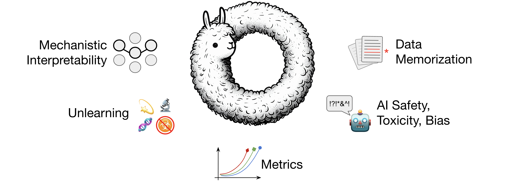

<!--<h1 align="center">Analysis360: Analyze LLMs in 360 degrees</h1>-->
<!--<h1 align="center">Analysis360: In-Depth Analysis of LLM360 Models</h1>-->
<!--<h1 align="center">Analysis360: Implementations of LLM Analyses</h1>-->
<!--<h1 align="center">Analysis360: Open Implementations of LLM Analyses</h1>-->
<h1 align="center">Analysis360:<br>Open Implementations of LLM Analyses</h1>

<div align="center">
   <br>
</div>

---

<p align="center">
   <a href="https://github.com/LLM360/Analysis360/blob/dev/LICENSE"></a>
   <a href="https://www.python.org/">
        
    </a>
</p>

**Welcome to Analysis360!**

Analysis360 provides open reference implementations for a variety of downstream analyses
that can be done with and for LLM360 models, covering a range of topics including:
mechanistic interpretability, visualization, machine unlearning, data memorization, AI
safety, assessing toxicity & bias, and a large set of evaluation metrics.

<!--## Quick Tour-->
## List of Analyses

- [Data Memorization](analysis/memorization/)
    - Methods to evaluate an LLM's memorization of data points during training.
- [LLM Unlearning](analysis/unlearning/)
    - Algorithms for machine unlearning in LLMs, to remove the knowledge of chosen topics.
- [Safety360 (AI safety, toxicity, bias)](analysis/safety360/)
    - Evaluations for toxicity, bias, and knowledge of dangerous topics (e.g., biosecurity, cybersecurity).
- [Mechanistic Interpretability](analysis/mechinterp/)
    - Transparency, visualization, control, and interpretability of LLMs.
- [Metrics and evaluations](analysis/metrics/)
    - Open LLM Leaderboard metrics, language & code metrics, perplexity evaluation, and more.


## Quick Start

In each subfolder of [`analysis`](analysis/) you will find instructions for
installation, documentation, and a demo notebook showing usage of a given analysis tool.
Experiments and demos in all subfolders use Python 3.11.

> [!TIP]
> Dive into each subfolder of [`analysis`](analysis/) and find the `demo.ipynb` notebook. Have fun!

## Citation

If you are interested in using our results in your work, you can cite the LLM360 overview paper.

```
@article{liu2023llm360,
title={LLM360: Towards Fully Transparent Open-Source LLMs},
author={Liu, Zhengzhong and Qiao, Aurick and Neiswanger, Willie and Wang, Hongyi and Tan, Bowen and Tao, Tianhua and Li, Junbo and Wang, Yuqi and Sun, Suqi and Pangarkar, Omkar and Fan, Richard and Gu, Yi and Miller, Victor and Zhuang, Yonghao and He, Guowei and Li, Haonan and Koto, Fajri and Tang, Liping and Ranjan, Nikhil and Shen, Zhiqiang and Ren, Xuguang and Iriondo, Roberto and Mu, Cun and Hu, Zhiting and Schulze, Mark and Nakov, Preslav and Baldwin, Tim and Xing, Eric},
year={2023}}
```
