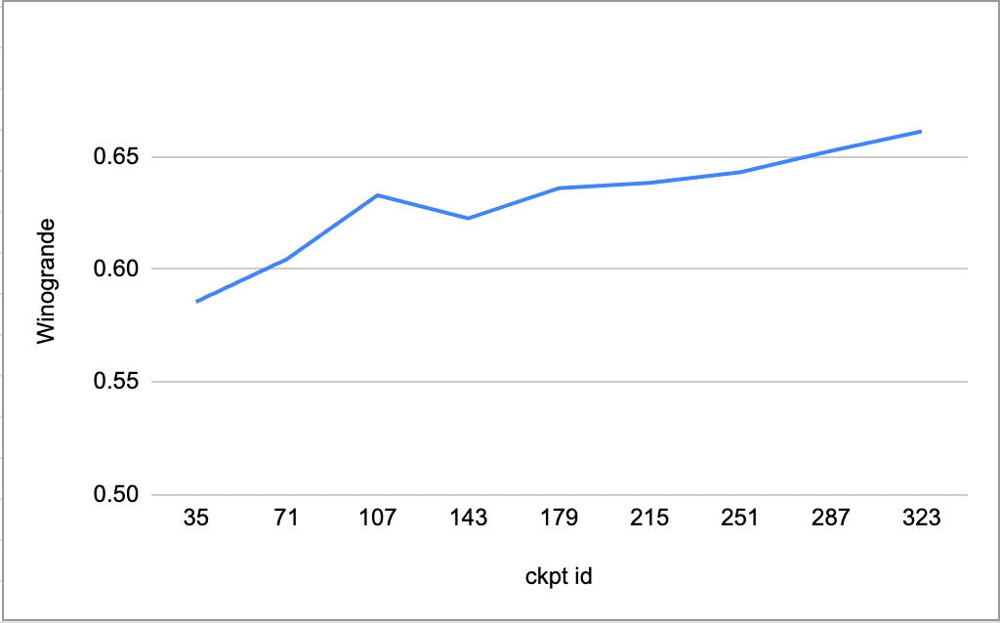

# Analysis360
Welcome to the evaluation and analysis Glossary for LLM360! 

To better observe and understand how our models develop and evolve over the training process, we introduce this glossary to provide in-depth analysis from many different aspects and hopefully it can faciliate research in the future. We selected 10 samples out of 360, there are checkpoint 35, 71, 107, 143, 179, 215, 251, 287, 323, 359. 

## Table of Contents
- [Analysis360](#analysis360)
  - [Table of Contents](#table-of-contents)
  - [Analysis Category](#analysis-category)
    - [Measure context sensntive coreference ability: Winogrande](#measure-context-sensntive-coreference-ability-winogrande)

## Analysis Category
### Measure context sensntive coreference ability: Winogrande

| Checkpoint Samples |           35 |           71 |          107 |          143 |         179 |        215 |          251 |          287 |          323 |
|--------------------|-------------:|-------------:|-------------:|-------------:|------------:|-----------:|-------------:|-------------:|-------------:|
| Winogrande         | 0.5856353591 | 0.6045777427 | 0.6329913181 | 0.6227308603 | 0.636148382 | 0.63851618 | 0.6432517758 | 0.6527229676 | 0.6614048934 |

We observed that overall the winogrande scores are increasing, indicating that our models are doing better and better jobs at commonsense reasoning, despite there's a drop on ckpt143.

