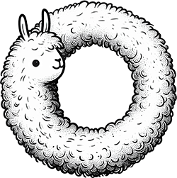

<h1 align="center">Analysis360: Analyze LLMs in 360 degrees</h1>

<div align="center">
   <br><br>
</div>

---

<p align="center">
   <a href="https://github.com/LLM360/Analysis360/blob/dev/LICENSE"></a>
</p>
<p align="center">
   HuggingFace Repositories 
  🤗 <a href="https://huggingface.co/LLM360/Amber">[Amber]</a> •
  🤗 <a href="https://huggingface.co/LLM360/CrystalCoder">[CrystalCoder]</a>
</p>
<p align="center">
  Metrics and charts&nbsp;&nbsp;&nbsp;&nbsp;&nbsp;&nbsp;&nbsp;&nbsp;&nbsp;&nbsp;&nbsp;&nbsp;&nbsp;
  📈 <a href="https://wandb.ai/llm360/Amber"> [Amber]</a> •
  📈 <a href="https://wandb.ai/llm360/CrystalCoder"> [CrystalCoder]</a>
</p>
<p align="center">
  Publications
   &nbsp;&nbsp;&nbsp;&nbsp;&nbsp;&nbsp;&nbsp;&nbsp;&nbsp;
   &nbsp;&nbsp;&nbsp;&nbsp;&nbsp;&nbsp;&nbsp;&nbsp;&nbsp;
   &nbsp;&nbsp;&nbsp;&nbsp;&nbsp;&nbsp;&nbsp;&nbsp;&nbsp;
   &nbsp;&nbsp;&nbsp;&nbsp;&nbsp;&nbsp;&nbsp;&nbsp;&nbsp;
  📃 <a href="">LLM360 Overview</a>
</p>

**Welcome to Analysis360!**
<br/>

This repo contains all of the code that we used for model evaluation and analysis. It serves as the single source of truth for all evaluation metrics and provides in-depth analysis from many different angles. Feel free to click on the links above to have a quick glance around the LLM360 project and experiments' data.

## Our Approach 

We run evaluations on a variety of benchmarks, including the conventional benchmarks like MMLU, Hellaswag, ARC, user-preference aligned benchmarks like MT-bench, long-context evaluations like LongEval, and additional studies on safety benchmarks for truthfulness, toxicity, and bias. Moreover, we report results on the model samples we preselected from a suite of LLMs where they all trained on same data seen in the exact same order to better observe and understand how our models develop and evolve over the training process. We also provide public access to all checkpoints, all code and all wandb dashboards for detailed training and evaluation curves. 

### W&B Dashboards
Every model has one wandb project/dashboard, each project will have multiple runs, and all of projects should be in the same base structure. For example, Amber project has runs `train`, `downstream_eval`, and `perplexity_eval`. The `train` run collects data for training processes like loss and learning rate while the others collects data for evaluation. Additionally, we added a `resources` section for Amber project to specifically record the resources related information for anyone who's interested. To quickly find the metric you are looking for, you could use the search bar on the top or/and the filter on the top right.

## List of Analysis and Metrics

Here's a full list of analysis/metrics we have collected so far. For each model we release, at this point, Amber and CrystalCoder, we put down the links to specific wandb reports if the evaluation is done. Amber and CrystalCoder currently use their own evaluation scripts, we are working on consolidating these in the future, more details can be found in later sections. Please refer to model cards ([Amber](https://huggingface.co/LLM360/Amber), [CrystalCoder](https://huggingface.co/LLM360/CrystalCoder)) for any terms or technology you find unfamiliar. We will keep updating and expanding the list as our study proceeds, please stay tuned on the upcoming changes!
| Metrics/Analysis                                                           | Description                                                                                                                                                 |                                                                   Amber                                                                   |                                                                                                                CrystalCoder                                                                                                                |
|----------------------------------------------------------------------------|-------------------------------------------------------------------------------------------------------------------------------------------------------------|:-----------------------------------------------------------------------------------------------------------------------------------------:|:------------------------------------------------------------------------------------------------------------------------------------------------------------------------------------------------------------------------------------------:|
| [mmlu](https://arxiv.org/abs/2009.03300)                                   | A test to measure a text model’s multitask accuracy. The test covers 57 tasks including elementary mathematics, US history, computer science, law, and more |                         [5 shot](https://wandb.ai/llm360/Amber/reports/mmlu-23-12-05-12-00-27---Vmlldzo2MTc1Njkx)                         |             [0 shot](https://wandb.ai/llm360/CrystalCoder/reports/MMLU-0-shot-23-12-05-12-26-58---Vmlldzo2MTc1OTIw)<br>[5 shot](https://wandb.ai/llm360/CrystalCoder/reports/MMLU-5-shot-23-12-05-12-31-30---Vmlldzo2MTc1OTgy)             |
| [race](https://arxiv.org/abs/1704.04683)                                   | A test to measure reading comprehension ablity                                                                                                              |                         [0 shot](https://wandb.ai/llm360/Amber/reports/race-23-12-05-12-01-31---Vmlldzo2MTc1NzAw)                         |                                                                   [0 shot](https://wandb.ai/llm360/CrystalCoder/reports/RACE-0-shot-23-12-05-12-27-47---Vmlldzo2MTc1OTI5)                                                                  |
| [arc_challenge](https://arxiv.org/abs/1803.05457)                          | A set of grade-school science questions                                                                                                                     |                         [25 shot](https://wandb.ai/llm360/Amber/reports/arc-23-12-05-12-02-08---Vmlldzo2MTc1NzA5)                         |           [0 shot](https://wandb.ai/llm360/CrystalCoder/reports/ARC-C-0-shot-23-12-06-11-10-01---Vmlldzo2MTg3NjEz)<br>[25 shot](https://wandb.ai/llm360/CrystalCoder/reports/ARC-C-25-shot-23-12-06-11-08-46---Vmlldzo2MTg3NjA0)           |
| [boolq](https://arxiv.org/abs/1905.10044)                                  | A question answering dataset for yes/no questions containing 15942 examples                                                                                 |                         [0 shot](https://wandb.ai/llm360/Amber/reports/boolq-23-12-05-12-03-24---Vmlldzo2MTc1NzE3)                        |                                                                  [0 shot](https://wandb.ai/llm360/CrystalCoder/reports/BoolQ-0-shot-23-12-05-12-28-19---Vmlldzo2MTc1OTM3)                                                                  |
| [hellaswag](https://arxiv.org/abs/1905.07830)                              | A test of commonsense inference                                                                                                                             |                      [10 shot](https://wandb.ai/llm360/Amber/reports/hellaswag-23-12-05-12-03-55---Vmlldzo2MTc1NzIw)                      |       [0 shot](https://wandb.ai/llm360/CrystalCoder/reports/HellaSwag-0-shot-23-12-05-12-25-18---Vmlldzo2MTc1OTA0)<br>[10 shot](https://wandb.ai/llm360/CrystalCoder/reports/HellaSwag-10-shot-23-12-05-12-47-16---Vmlldzo2MTc2MTAz)       |
| [openbookqa](https://arxiv.org/abs/1809.02789)                             | A question-answering dataset modeled after open book exams for assessing human understanding of a subject                                                   |                      [0 shot](https://wandb.ai/llm360/Amber/reports/openbookqa-23-12-05-12-04-39---Vmlldzo2MTc1NzI1)                      |                                                               [0 shot](https://wandb.ai/llm360/CrystalCoder/reports/Openbook-QA-0-shot-23-12-05-12-48-00---Vmlldzo2MTc2MTE0)                                                               |
| [piqa](https://arxiv.org/abs/1911.11641)                                   | A test to measure physical commonsense and reasoning                                                                                                        |                         [0 shot](https://wandb.ai/llm360/Amber/reports/piqa-23-12-05-12-05-40---Vmlldzo2MTc1NzMy)                         |                                                                   [0 shot](https://wandb.ai/llm360/CrystalCoder/reports/PIQA-0-shot-23-12-05-12-46-47---Vmlldzo2MTc2MTAx)                                                                  |
| [siqa](https://arxiv.org/abs/1904.09728)                                   | A test to measure commonsense reasoning about social interactions                                                                                           |                         [0 shot](https://wandb.ai/llm360/Amber/reports/siqa-23-12-05-12-07-33---Vmlldzo2MTc1NzUw)                         |                                                                                                                                                                                                                                            |
| [winogrande](https://arxiv.org/abs/1907.10641)                             | An adversarial and difficult Winograd benchmark at scale, for commonsense reasoning                                                                         |                      [0 shot](https://wandb.ai/llm360/Amber/reports/winogrande-23-12-05-12-08-04---Vmlldzo2MTc1NzU1)                      |       [0 shot](https://wandb.ai/llm360/CrystalCoder/reports/Winogrande-0-shot-23-12-05-12-30-16---Vmlldzo2MTc1OTY5)<br>[5 shot](https://wandb.ai/llm360/CrystalCoder/reports/Winogrande-5-shot-23-12-05-12-28-46---Vmlldzo2MTc1OTQ3)       |
| [crowspairs](https://arxiv.org/abs/2010.00133)                             | A challenge set for evaluating what language models (LMs) on their tendency to generate biased outputs                                                      |                      [0 shot](https://wandb.ai/llm360/Amber/reports/crowspairs-23-12-05-12-08-51---Vmlldzo2MTc1NzYz)                      |                                                                                                                                                                                                                                            |
| [truthfulqa](https://arxiv.org/abs/2109.07958)                             | A test to measure a model’s propensity to reproduce falsehoods commonly found online                                                                        |                      [0 shot](https://wandb.ai/llm360/Amber/reports/truthfulqa-23-12-05-12-12-08---Vmlldzo2MTc1Nzg4)                      |                                                               [0 shot](https://wandb.ai/llm360/CrystalCoder/reports/Truthful-QA-0-shot-23-12-05-12-49-09---Vmlldzo2MTc2MTIx)                                                               |
| [pile](https://pile.eleuther.ai/)                                          | A test to measure model's perplexity, we covered 18/22 sub datasets                                                                                         |                                         [perplexity](https://wandb.ai/llm360/Amber/runs/ut4txpqk)                                         |                                                                                                                                                                                                                                            |
| [drop](https://arxiv.org/abs/1903.00161)                                   | A reading comprehension benchmark requiring discrete reasoning over paragraphs                                                                              |                                                                                                                                           |                                                                   [3 shot](https://wandb.ai/llm360/CrystalCoder/reports/DROP-3-shot-23-12-05-12-55-44---Vmlldzo2MTc2MTU1)                                                                  |
| [mbpp](https://arxiv.org/abs/2108.07732)                                   | Around 1,000 crowd-sourced Python programming problems, designed to be solvable by entry-level programmers                                                  |                                                                                                                                           |      [pass 1](https://wandb.ai/llm360/CrystalCoder/reports/MBPP-pass-1-t-0-1-23-12-05-12-42-33---Vmlldzo2MTc2MDcw)<br>[pass 10](https://wandb.ai/llm360/CrystalCoder/reports/MBPP-pass-10-t-0-1-23-12-05-12-41-45---Vmlldzo2MTc2MDYy)      |
| [humaneval](https://arxiv.org/abs/2107.03374)                              | A test to measure functional correctness for synthesizing programs from docstrings                                                                          |                                                                                                                                           | [pass 1](https://wandb.ai/llm360/CrystalCoder/reports/HumanEval-pass-1-t-0-2-23-12-05-12-45-51---Vmlldzo2MTc2MDk0)<br>[pass 10](https://wandb.ai/llm360/CrystalCoder/reports/HumanEval-pass-10-t-0-2-23-12-05-12-48-34---Vmlldzo2MTc2MTE2) |
| [gsm8k](https://arxiv.org/abs/2110.14168)                                  | Diverse grade school math word problems to measure a model's ability to solve multi-step mathematical reasoning problems                                    |                                                                                                                                           |                                                                  [5 shot](https://wandb.ai/llm360/CrystalCoder/reports/GSM8K-5-shot-23-12-05-12-50-29---Vmlldzo2MTc2MTI4)                                                                  |
| [copa](https://arxiv.org/abs/2203.08398)                                   | A test to assess progress in open-domain commonsense causal reasoning                                                                                       |                                                                                                                                           |                                                                   [0 shot](https://wandb.ai/llm360/CrystalCoder/reports/COPA-0-shot-23-12-05-12-52-54---Vmlldzo2MTc2MTQy)                                                                  |
| [toxigen](https://arxiv.org/abs/2203.09509)                                | A test to measure model's toxicity on text generation                                                                                                       |         [toxigen](https://wandb.ai/llm360/Amber/reports/toxigen-and-toxicity-identification-23-12-06-15-24-39---Vmlldzo2MTg5NTcy)         |                                                                                                                                                                                                                                            |
| [toxicity identification](https://arxiv.org/abs/2305.13169)                | A test to measure model's capability on identifying toxic text                                                                                              | [toxicity identification](https://wandb.ai/llm360/Amber/reports/toxigen-and-toxicity-identification-23-12-06-15-24-39---Vmlldzo2MTg5NTcy) |                                                                                                                                                                                                                                            |
| [bold](https://arxiv.org/abs/2101.11718)                                   | A test to evaluate fairness in open-ended language generation in English language                                                                           |                          [bold](https://wandb.ai/llm360/Amber/reports/bold-23-12-06-15-27-23---Vmlldzo2MTg5NTky)                          |                                                                                                                                                                                                                                            |
| [memorization and token orders analysis](https://arxiv.org/abs/2202.07646) | An analysis to understand model's memorization abilities                                                                                                    |                  [memorization](https://wandb.ai/llm360/Amber/reports/memorization-23-12-06-15-29-48---Vmlldzo2MTg5NjEx)                  |                                                                                                                                                                                                                                            |
## How to reproduce our results
Most of our evaluations are built based on [lm-evaluation-harness](https://github.com/EleutherAI/lm-evaluation-harness)'s core `lm_eval` module. We reused the metrics that were supported by harness and added in our own to support more. Please follow the instructions [here](./harness/README.md) to get started. For any metric that's not included in the harness folder, users should be able to find a dedicated folder for that metric in the root level of the repo and follow the instructions there. Note, we are still working on getting code consolidated and uploaded so please wait for future releases to fill out the missing gaps.

## Citation
If you are interested in using our results in your work, you can cite the LLM360 overview paper.
```
@article{liu2023llm360,
title={LLM360: Towards Fully Transparent Open-Source LLMs},
author={Liu, Zhengzhong and Qiao, Aurick and Neiswanger, Willie and Wang, Hongyi and Tan, Bowen and Tao, Tianhua and Li, Junbo and Wang, Yuqi and Sun, Suqi and Pangarkar, Omkar and Fan, Richard and Gu, Yi and Miller, Victor and Zhuang, Yonghao and He, Guowei and Li, Haonan and Koto, Fajri and Tang, Liping and Ranjan, Nikhil and Shen, Zhiqiang and Ren, Xuguang and Iriondo, Roberto and Mu, Cun and Hu, Zhiting and Schulze, Mark and Nakov, Preslav and Baldwin, Tim and Xing, Eric},
year={2023}}
```
