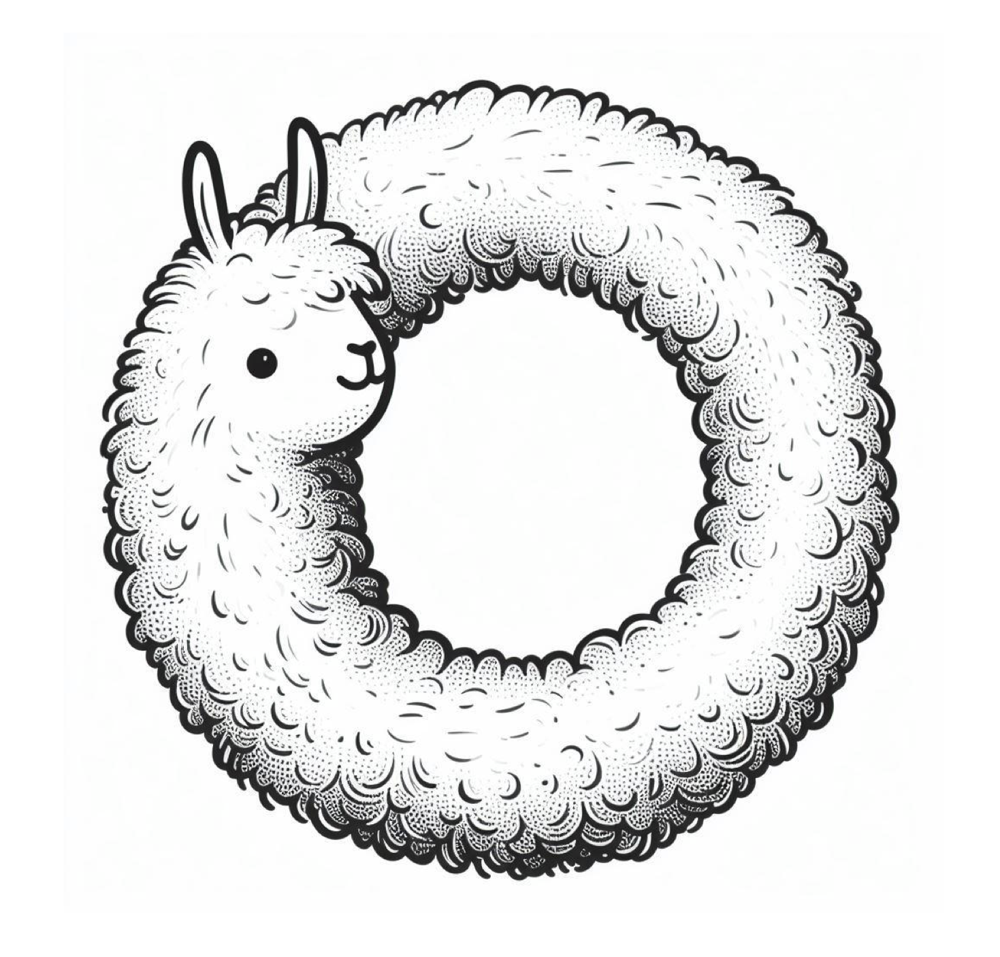

# Analysis360: Analyze LLMs in 360 degrees

     

---

   

  <a href="">Blogpost[Amber]</a> •
  <a href="https://wandb.ai/llm360/Amber">wandb dashboard[Amber]</a> •
  <a href="">Blogpost[CrystalCoder]</a> •
  <a href="https://wandb.ai/llm360/CrystalCoder">wandb dashboard[CrystalCoder]</a> •
  <a href="">Publication</a>

Welcome to LLM360!

This repo contains all the code that we used for model evaluation and analysis. It serves as the single source of truth for all evaluation metrics and provides in-depth analysis from many different angles.

## Our Approach 

We run evaluations on a variety of benchmarks, including the conventional benchmarks like MMLU, Hellaswag, user-preference aligned benchmarks like MT-bench, long-context evaluations like LongEval, and additional studies on safety benchmarks for truthfulness, toxicity and bias. Moreover, we report results on the model samples we preselectedfrom a suite of LLMs where they all trained on same data seen in the exact same order to better observe and understand how our models develop and evolve over the training process. We also provide public access to all checkpoints, all code and all wandb dashboards for detailed training and evaluation curves.

## List of Analysis and Metrics

Here's a full list of analysis/metrics we have collected so far. We will keep expanding the list as our study proceeds, please stay tuned on the upcoming changes!
| Metrics/Analysis                                                                     | Description                                                                                                                                                 |                                               Amber                                              |                                                                                                                CrystalCoder                                                                                                               |
|--------------------------------------------------------------------------------------|-------------------------------------------------------------------------------------------------------------------------------------------------------------|:------------------------------------------------------------------------------------------------:|:-----------------------------------------------------------------------------------------------------------------------------------------------------------------------------------------------------------------------------------------:|
| [mmlu](https://arxiv.org/abs/2009.03300)                                             | a test to measure a text model’s multitask accuracy. The test covers 57 tasks including elementary mathematics, US history, computer science, law, and more |    [&check;](https://wandb.ai/llm360/Amber/reports/mmlu-23-12-05-12-00-27---Vmlldzo2MTc1Njkx)    |             [&check;](https://wandb.ai/llm360/CrystalCoder/reports/MMLU-0-shot-23-12-05-12-26-58---Vmlldzo2MTc1OTIw)  [&check;](https://wandb.ai/llm360/CrystalCoder/reports/MMLU-5-shot-23-12-05-12-31-30---Vmlldzo2MTc1OTgy)            |
| [race](https://arxiv.org/abs/1704.04683)                                             | a test to measure reading comprehension ablity                                                                                                              |    [&check;](https://wandb.ai/llm360/Amber/reports/race-23-12-05-12-01-31---Vmlldzo2MTc1NzAw)    |                                                                  [&check;](https://wandb.ai/llm360/CrystalCoder/reports/RACE-0-shot-23-12-05-12-27-47---Vmlldzo2MTc1OTI5)                                                                 |
| [arc_challenge](https://arxiv.org/abs/1803.05457)                                    | a set of grade-school science questions                                                                                                                     |     [&check;](https://wandb.ai/llm360/Amber/reports/arc-23-12-05-12-02-08---Vmlldzo2MTc1NzA5)    |                                                                                                                                                                                                                                           |
| [boolq](https://arxiv.org/abs/1905.10044)                                            | a question answering dataset for yes/no questions containing 15942 examples                                                                                 |    [&check;](https://wandb.ai/llm360/Amber/reports/boolq-23-12-05-12-03-24---Vmlldzo2MTc1NzE3)   |                                                                 [&check;](https://wandb.ai/llm360/CrystalCoder/reports/BoolQ-0-shot-23-12-05-12-28-19---Vmlldzo2MTc1OTM3)                                                                 |
| [hellaswag](https://arxiv.org/abs/1905.07830)                                        | a test of commonsense inference                                                                                                                             |  [&check;](https://wandb.ai/llm360/Amber/reports/hellaswag-23-12-05-12-03-55---Vmlldzo2MTc1NzIw) |       [&check;](https://wandb.ai/llm360/CrystalCoder/reports/HellaSwag-0-shot-23-12-05-12-25-18---Vmlldzo2MTc1OTA0)  [&check;](https://wandb.ai/llm360/CrystalCoder/reports/HellaSwag-10-shot-23-12-05-12-47-16---Vmlldzo2MTc2MTAz)       |
| [openbookqa](https://arxiv.org/abs/1809.02789)                                       | a question-answering dataset modeled after open book exams for assessing human understanding of a subject                                                   | [&check;](https://wandb.ai/llm360/Amber/reports/openbookqa-23-12-05-12-04-39---Vmlldzo2MTc1NzI1) |                                                              [&check;](https://wandb.ai/llm360/CrystalCoder/reports/Openbook-QA-0-shot-23-12-05-12-48-00---Vmlldzo2MTc2MTE0)                                                              |
| [piqa](https://arxiv.org/abs/1911.11641)                                             | a test to measure physical commonsense and reasoning                                                                                                        |    [&check;](https://wandb.ai/llm360/Amber/reports/piqa-23-12-05-12-05-40---Vmlldzo2MTc1NzMy)    |                                                                  [&check;](https://wandb.ai/llm360/CrystalCoder/reports/PIQA-0-shot-23-12-05-12-46-47---Vmlldzo2MTc2MTAx)                                                                 |
| [siqa](https://arxiv.org/abs/1904.09728)                                             | a test to measure commonsense reasoning about social interactions                                                                                           |    [&check;](https://wandb.ai/llm360/Amber/reports/siqa-23-12-05-12-07-33---Vmlldzo2MTc1NzUw)    |                                                                                                                    N/A                                                                                                                    |
| [winogrande](https://arxiv.org/abs/1907.10641)                                       | an adversarial and difficult Winograd benchmark at scale, for commonsense reasoning                                                                         | [&check;](https://wandb.ai/llm360/Amber/reports/winogrande-23-12-05-12-08-04---Vmlldzo2MTc1NzU1) |       [&check;](https://wandb.ai/llm360/CrystalCoder/reports/Winogrande-0-shot-23-12-05-12-30-16---Vmlldzo2MTc1OTY5)  [&check;](https://wandb.ai/llm360/CrystalCoder/reports/Winogrande-5-shot-23-12-05-12-28-46---Vmlldzo2MTc1OTQ3)      |
| [crowspairs](https://arxiv.org/abs/2010.00133)                                       | a challenge set for evaluating what language models (LMs) on their tendency to generate biased outputs                                                      | [&check;](https://wandb.ai/llm360/Amber/reports/crowspairs-23-12-05-12-08-51---Vmlldzo2MTc1NzYz) |                                                                                                                    N/A                                                                                                                    |
| [truthfulqa](https://arxiv.org/abs/2109.07958)                                       | a test to measure a model’s propensity to reproduce falsehoods commonly found online                                                                        | [&check;](https://wandb.ai/llm360/Amber/reports/truthfulqa-23-12-05-12-12-08---Vmlldzo2MTc1Nzg4) |                                                              [&check;](https://wandb.ai/llm360/CrystalCoder/reports/Truthful-QA-0-shot-23-12-05-12-49-09---Vmlldzo2MTc2MTIx)                                                              |
| [pile](https://pile.eleuther.ai/)                                                    | a test to measure model's perplexity, we covered 18/22 sub datasets                                                                                         |                      [&check;](https://wandb.ai/llm360/Amber/runs/ut4txpqk)                      |                                                                                                                    N/A                                                                                                                    |
| [drop](https://arxiv.org/abs/1903.00161)                                             | A reading comprehension benchmark requiring discrete reasoning over paragraphs                                                                              |                                                N/A                                               |                                                                  [&check;](https://wandb.ai/llm360/CrystalCoder/reports/DROP-3-shot-23-12-05-12-55-44---Vmlldzo2MTc2MTU1)                                                                 |
| [mbpp](https://arxiv.org/abs/2108.07732)                                             | around 1,000 crowd-sourced Python programming problems, designed to be solvable by entry-level programmers                                                  |                                                N/A                                               |      [&check;](https://wandb.ai/llm360/CrystalCoder/reports/MBPP-pass-1-t-0-1-23-12-05-12-42-33---Vmlldzo2MTc2MDcw)  [&check;](https://wandb.ai/llm360/CrystalCoder/reports/MBPP-pass-10-t-0-1-23-12-05-12-41-45---Vmlldzo2MTc2MDYy)      |
| [humaneval](https://arxiv.org/abs/2107.03374)                                        | a test to measure functional correctness for synthesizing programs from docstrings                                                                          |                                                N/A                                               | [&check;](https://wandb.ai/llm360/CrystalCoder/reports/HumanEval-pass-1-t-0-2-23-12-05-12-45-51---Vmlldzo2MTc2MDk0)  [&check;](https://wandb.ai/llm360/CrystalCoder/reports/HumanEval-pass-10-t-0-2-23-12-05-12-48-34---Vmlldzo2MTc2MTE2) |
| [gsm8k](https://arxiv.org/abs/2110.14168)                                            | diverse grade school math word problems to measure a model's ability to solve multi-step mathematical reasoning problems                                    |                                                N/A                                               | [&check;](https://wandb.ai/llm360/CrystalCoder/reports/GSM8K-5-shot-23-12-05-12-50-29---Vmlldzo2MTc2MTI4)                                                                                                                                 |
| [copa](https://arxiv.org/abs/2203.08398)                                             | a test to assess progress in open-domain commonsense causal reasoning                                                                                       |                                                N/A                                               | [&check;](https://wandb.ai/llm360/CrystalCoder/reports/COPA-0-shot-23-12-05-12-52-54---Vmlldzo2MTc2MTQy)                                                                                                                                  |
| [toxigen](https://arxiv.org/abs/2203.09509)                                          | a test to measure model's toxicity on text generation                                                                                                       |                                                                                                  |                                                                                                                                                                                                                                           |
| [bold](https://arxiv.org/abs/2101.11718)                                             | a test to evaluate fairness in open-ended language generation in English language                                                                           |                                                                                                  |                                                                                                                                                                                                                                           |
| [mt-bench](https://arxiv.org/abs/2306.05685)                                         | a challenging multi-turn question set designed to evaluate the conversational and instruction-following ability of models                                   |                                                                                                  |                                                                                                                                                                                                                                           |
| [longeval](https://lmsys.org/blog/2023-06-29-longchat/#evaluation-toolkits-longeval) | a test to measure how long can LLMs truly promise on context                                                                                                |                                                                                                  |                                                                                                                                                                                                                                           |
| [calibration analysis](https://arxiv.org/abs/2207.05221)                             | an analysis to evaluate the tradeoffs between bias generation and identification                                                                            |                                                                                                  |                                                                                                                                                                                                                                           |
## How to reproduce our results
Most of our evaluations are built based on [lm-evaluation-harness](https://github.com/EleutherAI/lm-evaluation-harness)'s core `lm_eval` module. We reused the metrics that were supported by harness and added in our own to support more. Please follow the instructions [here](./harness/README.md) to get started. For any metric that's not included, users should be able to find a dedicated folder for that metric in the root level of the repo and follow the instructions there.